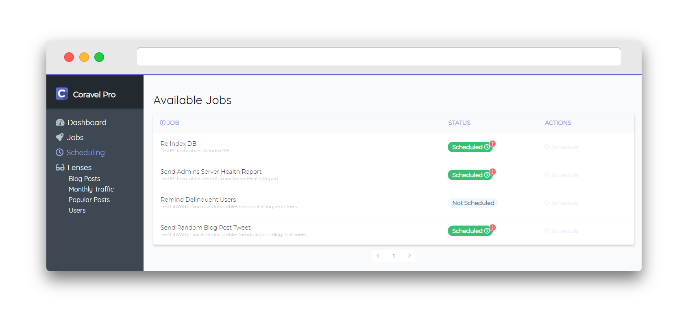
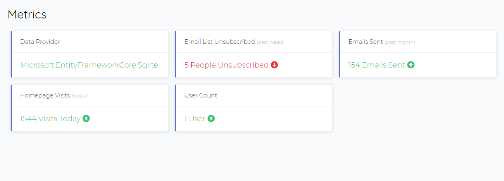
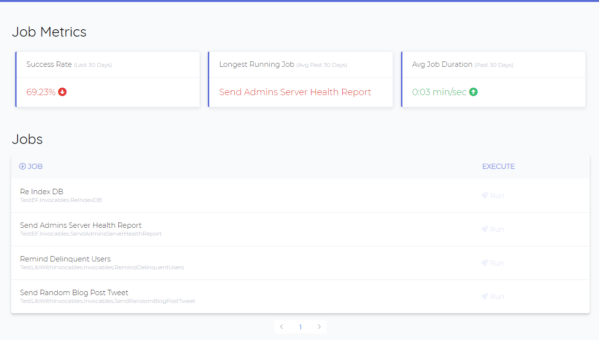
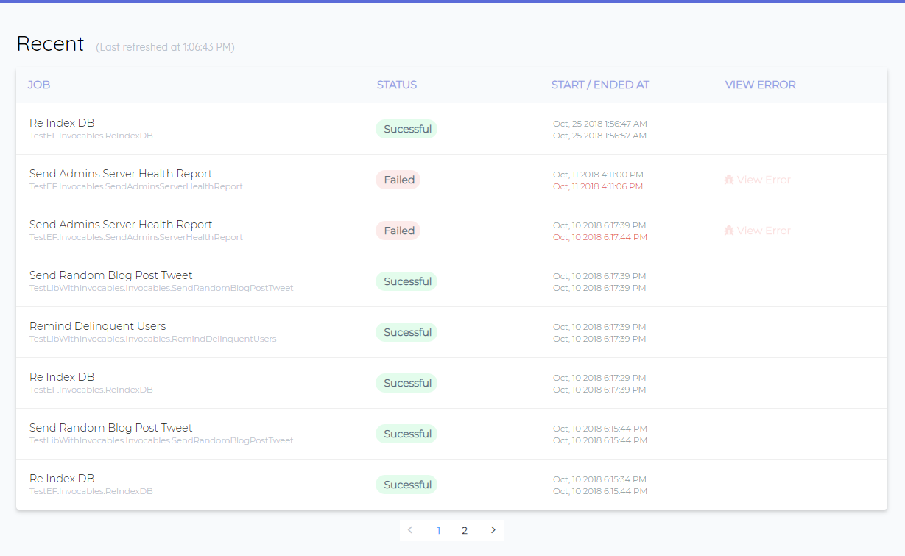
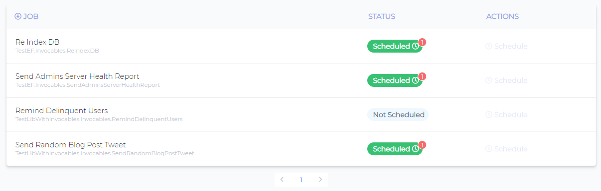

# Coravel Pro

A professional suite of admin tools for your .NET Core apps!

Coravel Pro integrates seamlessly into your app to give you a near-zero config admin backend! Ditch the database IDE to manage your important backend tasks and finally focus on building your app!

## Repo Purpose

This repo is where you can file issues and view the roadmap for Coravel Pro.

## Official Sites / Documentation

You may view the [official documentation here](https://www.docs.pro.coravel.net/Installation/).

You may visit the [official web site](https://www.pro.coravel.net) for more details / licensing.

## Features / Screenshots

Here are some screenshots to peek your interest 😉

### Metrics Dashboard

These are custom metrics that you configure using any data you want - really. Hook into your EF Core data or an external API if needed! Just pass your data to Coravel Pro and it'll handle making everything look pretty 👌

### Job Management

Manage important admin tasks like database re-indexing, sending out automated e-mail reminders, etc. 😎

### Job History

View a history of all successful and failed jobs. Drilldown into failed job errors. 🔥

### Database Persisted Job Scheduling

Schedule your jobs using a beautiful and intuitive user interface. No need to worry about your development schedules bleeding into your production schedules! "What happens in prod stays in prod." 🐱‍👤

